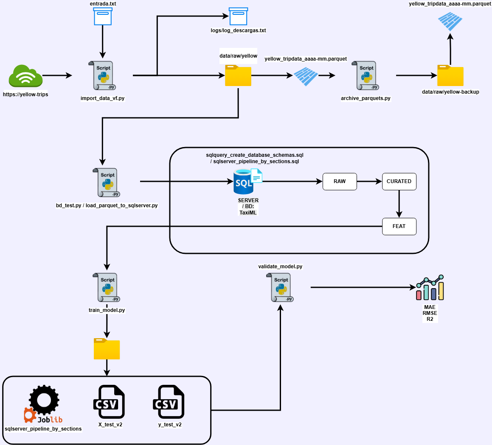

# TaxiML — ETL + SQL Server + ML (NYC TLC Yellow Trips)

---

## Resumen

Este repositorio implementa un flujo **end-to-end** para:

- **Descargar** datasets mensuales de *Yellow Taxi Trips* (formato **PARQUET**) desde el portal oficial de NYC TLC.
- **Archivar** los parquets localmente para mantener histórico.
- **Cargar** los datos a **SQL Server** en una capa **RAW**.
- **Transformar** y depurar datos dentro de SQL Server hacia capas **CURATED** y **FEAT**.
- **Entrenar** un modelo de **Regresión Lineal** para predecir `trips_count` (conteo de viajes por hora y zona).
- **Validar** el modelo con métricas y un baseline.

> El entrenamiento usa el objetivo transformado: `y_log = log(1 + trips_count)` (*log1p*) para estabilizar la variabilidad del conteo cuando hay picos.

---

## Arquitectura / Flujo End-to-End



---

## Tecnologías implementadas

- **Python** (pandas, numpy, sqlalchemy, pyodbc, scikit-learn, joblib)
- **Microsoft SQL Server** (schemas: `raw`, `curated`, `feat`, `ml`)
- **PARQUET** (descarga + backup)
- **Modelo**: `LinearRegression` (scikit-learn) + `log1p` + `sample_weight`

---

## Fuente de datos

- NYC TLC Trip Record Data (Yellow Trips): https://www.nyc.gov/site/tlc/about/tlc-trip-record-data.page

---

## Componentes del repositorio (por archivo)

### Python
- **1) Descarga de datasets (TLC → PARQUET):** [`docs/import_data_vf.md`](./docs/import_data_vf.md)
- **2) Archivado de parquets (PARQUET → backup):** [`docs/archive_parquets.md`](./docs/archive_parquets.md)
- **3) Test de conexión a SQL Server:** [`docs/db_test.md`](./docs/db_test.md)
- **4) Carga a SQL Server (PARQUET → RAW):** [`docs/load_parquet_to_sqlserver.md`](./docs/load_parquet_to_sqlserver.md)
- **7) Entrenamiento (FEAT → artifacts/):** [`docs/train_model.md`](./docs/train_model.md)
- **8) Validación (artifacts → métricas):** [`docs/validate_model.md`](./docs/validate_model.md)

### SQL Server
- **5) Creación BD + schemas:** [`docs/sqlquery_create_database_schemas.md`](./docs/sqlquery_create_database_schemas.md)
- **6) Pipeline por capas (RAW → CURATED → FEAT):** [`docs/sqlserver_pipeline_by_sections.md`](./docs/sqlserver_pipeline_by_sections.md)

---

## Orden recomendado de ejecución
### 0) Requisitos
1. Tener SQL Server disponible (local o remoto).
2. Instalar dependencias de Python:

```bash
pip install pandas numpy sqlalchemy pyodbc scikit-learn joblib
```

> Recomendación: usar un `venv` y manejar credenciales por variables de entorno (evitar hardcode).

---

### 1) Crear base de datos y schemas (una sola vez por ambiente)
Ejecutar en SSMS:
- `sqlquery_create_database_schemas.sql`

Resultado esperado:
- Base de datos: `TaxiML`
- Schemas: `raw`, `curated`, `feat`, `ml`

---

### 2) Descargar datasets (Yellow Trips → PARQUET)
```bash
python import_data_vf.py
```

---

### 3) Archivar parquets (opcional, recomendado)
```bash
python archive_parquets.py
```

---

### 4) Probar conexión a SQL Server
```bash
python db_test.py
```

---

### 5) Cargar parquets a SQL Server (RAW)
```bash
python load_parquet_to_sqlserver.py
```

---

### 6) Transformaciones en SQL Server (RAW → CURATED → FEAT)
Ejecutar en SSMS:
- `sqlserver_pipeline_by_sections.sql`

Resultado esperado:
- capa `curated` creada/actualizada
- capa `feat` lista para entrenamiento

---

### 7) Entrenar modelo (FEAT → artifacts/)
```bash
python train_model.py
```

Resultado esperado:
- `artifacts/*.joblib`
- `artifacts/X_test*.csv`
- `artifacts/y_test_real*.csv`

---

### 8) Validar modelo (artifacts → métricas)
```bash
python validate_model.py
```

Resultado esperado:
- MAE / RMSE / R² + baseline en consola
- resultados en `artifacts/`

---

## Consideraciones futuras

- Orquestación (ejecución programada / pipelines)
- Carga incremental (evitar duplicados en RAW)
- Features adicionales (calendario, clima, eventos)
- Modelos alternativos (regularización, árboles/boosting)

---

## Licencia ☑️

Copyright 2026 Keiver Reinaldo Rincon Pabon

---

## Author ‍♂️

- [@keiver31](https://www.github.com/keiver31)
