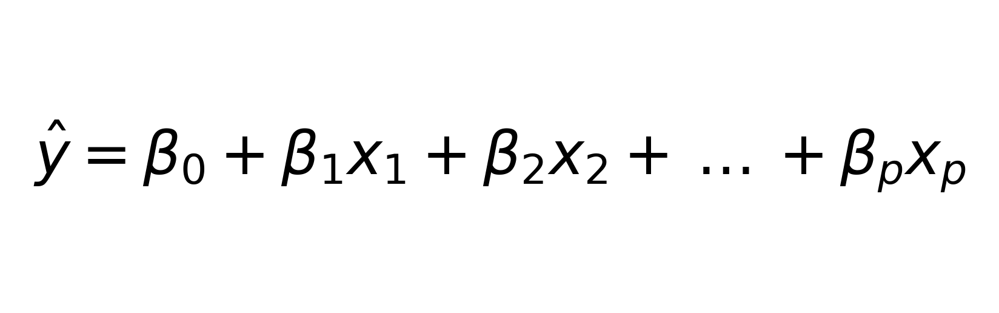
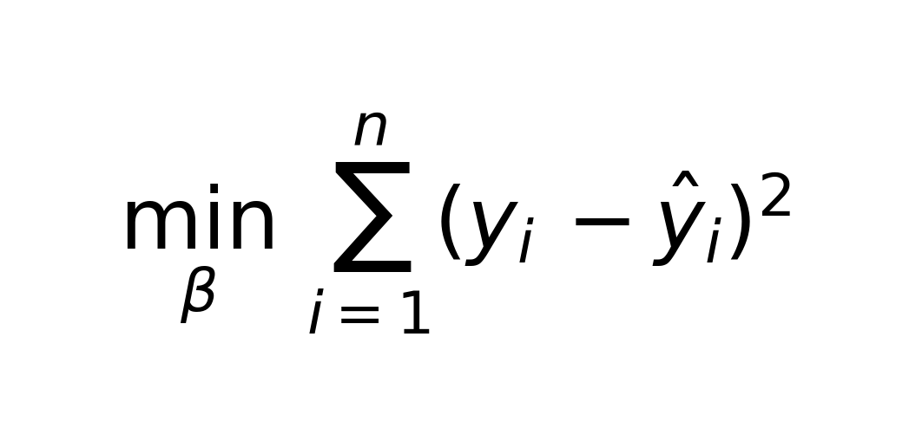
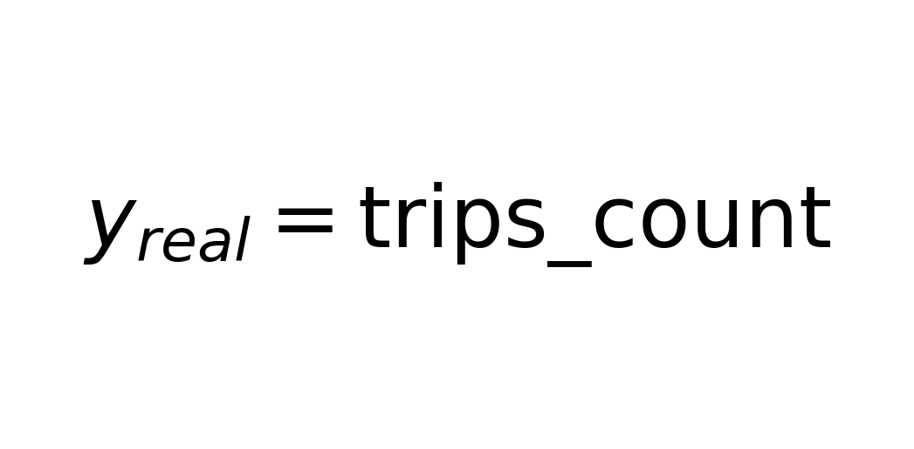
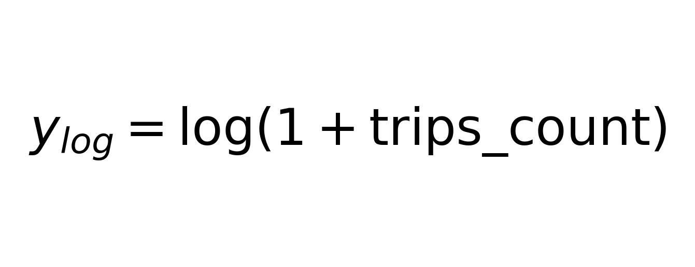
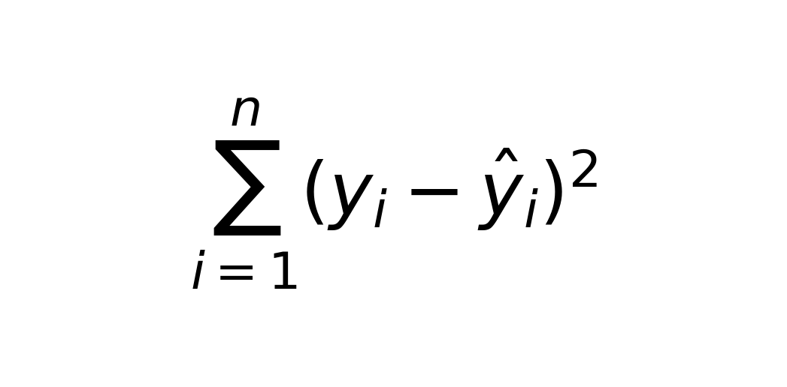
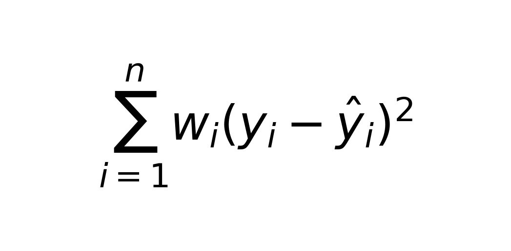
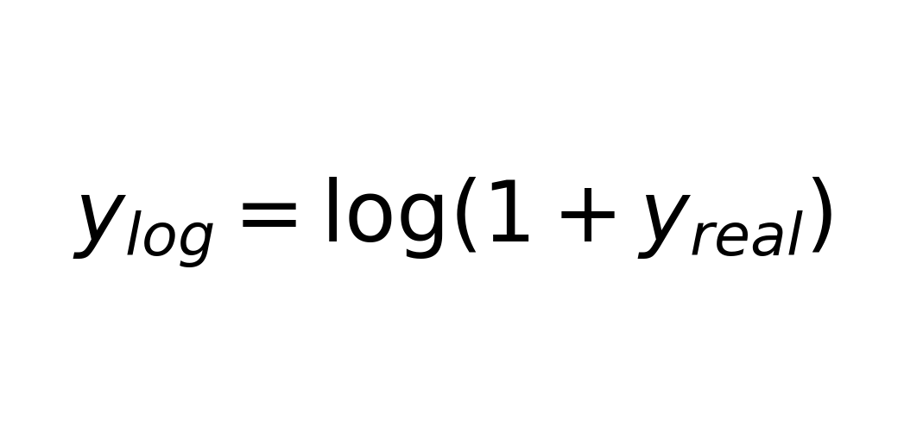

# Documentación teórica del entrenamiento (Regresión Lineal) — TaxiML

Este documento explica **la lógica teórica** detrás del proceso de entrenamiento del modelo de **regresión lineal** usado en el proyecto TaxiML.  
El objetivo es conectar el **modelo matemático** con las decisiones del pipeline (features, transformaciones, split, pesos y artefactos), sin depender de “cómo se programa”.

---

## 0) ¿Qué problema está resolviendo este proyecto?

El modelo busca **predecir la demanda**: cuántos viajes (`trips_count`) ocurren en una **zona de recogida** (`PULocationID`) y una **hora** específica.

En términos de Machine Learning (ML):

- **Objetivo (`y`)**: un valor numérico continuo (conteo de viajes).
- **Variables de entrada (`X`)**: señales que pueden explicar la demanda (hora, calendario, promedios de distancia/duración/monto, zona).
- **Modelo**: regresión lineal, entrenada sobre una versión transformada del objetivo (escala logarítmica) para mejorar estabilidad.

---

## 1) Regresión lineal: el modelo matemático

La regresión lineal intenta aproximar la relación entre entradas y salida con una función lineal:

Donde:

-  son las **features** (hora, día, distancia, etc.)
-  es el intercepto (valor base)
-  son los **coeficientes** aprendidos (qué tanto “pesa” cada variable)
-  es la predicción del modelo

### ¿Qué significa “entrenar”?

Entrenar es **encontrar los coeficientes**  que minimicen el error entre lo observado  y lo predicho .

El criterio más común es minimizar el **Error Cuadrático Medio (MSE)**:

Esto obliga al modelo a ajustar  para que, en promedio, la predicción se acerque lo más posible a los valores reales.

---

## 2) Por qué leer “features” desde SQL también es teoría

En ML, un modelo no aprende bien desde datos crudos si no se organizan y representan correctamente.  
Por eso existen las **features**: variables diseñadas para capturar patrones relevantes.

En este proyecto, la tabla `feat.features_hour_zone` ya está estructurada para modelar: cada fila representa un “contexto” resumido:

> fecha + hora + zona + promedios estadísticos → demanda (conteo de viajes)

Esto corresponde a **ingeniería de features**: transformar eventos individuales (viajes) en variables estables que el modelo puede usar para aprender relaciones.

---

## 3) Variables de calendario: por qué se incluyen

Se incorporan variables como:

- `day_of_week` (día de la semana)
- `month` (mes)
- `day_of_month` (día del mes)

Porque la demanda suele tener **estacionalidad** (patrones repetidos en el tiempo), por ejemplo:

- lunes ≠ sábado
- enero ≠ diciembre
- inicio de mes ≠ quincena ≠ fin de mes

En teoría, estas variables ayudan al modelo a capturar **comportamientos sistemáticos** sin necesidad de algoritmos más complejos.

---

## 4) Objetivo real vs objetivo en log: el “por qué” matemático

El objetivo original es:

Para entrenar, se usa una transformación:

### ¿Por qué aplicar logaritmo?

Los conteos de demanda suelen:

- ser **asimétricos** (muchos valores bajos y pocos picos muy altos)
- presentar **varianza creciente** (a mayor conteo, mayor dispersión)
- hacer que el MSE se “domine” por picos (los errores grandes pesan demasiado)

La transformación log:

- “comprime” los valores altos
- vuelve el entrenamiento más estable
- reduce problemas de **heterocedasticidad** (varianza no constante)

En palabras simples: el modelo puede aprender un patrón general sin quedar “secuestrado” por unos pocos picos extremos.

---

## 5) `PULocationID` y una regla clave: categorías ≠ magnitudes

`PULocationID` es un **identificador de zona**, no un número con escala o magnitud.

Si se tratara como número (10, 20, 30…), el modelo podría interpretar una relación incorrecta como:

> “zona 30 es 3 veces zona 10”

Eso no tiene sentido porque las zonas son etiquetas.

### One-hot encoding (codificación por indicadores)

La solución teórica consiste en representar cada zona como una columna binaria:

- `PULocationID_125 = 1` si la fila pertenece a esa zona, si no 0.

Esto permite que el modelo aprenda un “ajuste” específico por zona sin inventarse relaciones numéricas falsas.

---

## 6) Train/Test split: la base de la generalización

Separar datos en entrenamiento y prueba no es un detalle técnico: es la forma estándar de medir si el modelo **generaliza** (funciona con datos nuevos).

- **Train**: se usa para aprender 
- **Test**: se usa para evaluar el desempeño fuera de la muestra de entrenamiento

Concepto clave: prevenir **overfitting**, es decir, que el modelo se adapte demasiado al pasado y falle al predecir nuevos casos.

En este proyecto se conserva el mismo corte (split) tanto para:

-  (escala de entrenamiento)
-  (escala real, para interpretar resultados en “conteo de viajes”)

---

## 7) Entrenamiento con pesos (`sample_weight`): cuando algunos errores “cuestan más”

En muchos casos, el negocio no valora igual todos los errores.  
Por ejemplo: equivocarse en picos de demanda puede ser más crítico que equivocarse en momentos normales.

En teoría, esto se modela con una función de pérdida ponderada:

De:

A:

Donde:

-  es el peso (importancia) del ejemplo 

### Interpretación práctica de los pesos

- Casos normales: peso 1
- Casos altos: peso > 1
- Casos pico: peso aún mayor

Esto expresa una preferencia del entrenamiento:

- “Quiero que el modelo acierte mejor cuando hay alta demanda”
- “Estoy dispuesto a sacrificar un poco lo normal si gano precisión en picos”

> Nota de consistencia: si se documenta un esquema 1/5/10, debe coincidir con la asignación real de pesos. Si no, el reporte de pesos puede confundir la interpretación.

---

## 8) Artefactos del entrenamiento: qué se guarda y por qué

Un entrenamiento serio produce “artefactos” que permiten repetir, auditar y desplegar el modelo:

1. **Modelo entrenado**  
   Contiene los coeficientes  aprendidos y la configuración del modelo.

2. **Conjunto de prueba (`X_test`)**  
   Permite evaluar de forma consistente y reproducible.

3. **Objetivo real (`y_test_real`)**  
   Permite validar métricas en unidades reales (conteo de viajes), que es lo que entiende el negocio.

4. **Objetivo log (`y_test_log`)** *(opcional)*  
   Útil para depuración y análisis en la misma escala en la que se entrenó.

Esto aporta:

- reproducibilidad
- trazabilidad
- auditoría
- buenas prácticas básicas de MLOps

---

## 9) Resumen del flujo teórico completo

1. Se parte de un fenómeno real: **demanda de taxis por zona y hora**.
2. Se crean **features agregadas** que resumen el contexto y reducen ruido.
3. Se define el objetivo  y se usa una transformación log para estabilizar el entrenamiento.
4. Se separan datos en train/test para medir generalización y evitar overfitting.
5. Se ajusta la función de pérdida con pesos para priorizar casos críticos (altos/picos).
6. Se guardan artefactos para repetir, validar y usar el modelo en producción.

---

## Apéndice: fórmulas clave

### Regresión lineal

### MSE (no ponderado)

### MSE ponderado

### Transformación log usada en el objetivo

---
